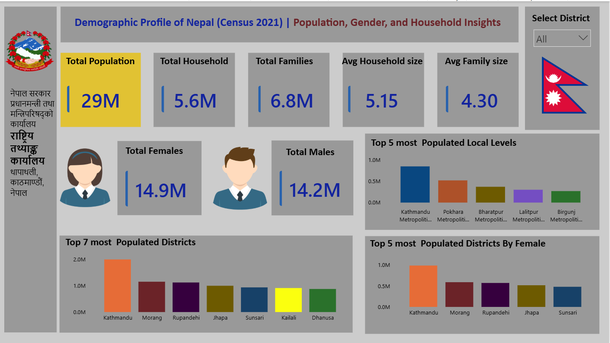
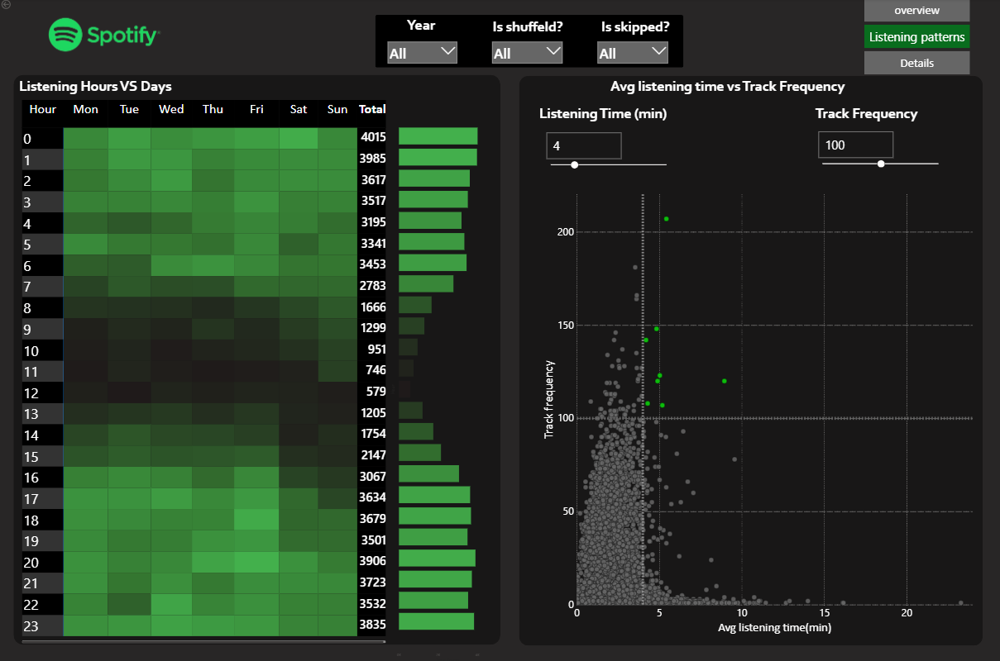

<h1 align="center">
   
  Ishwor Subedi
</h1>

<h3 align="center">
  📊 Data Analyst | 📈 Business Intelligence | 🎯 Analytics Specialist
</h3>

  <b>Transforming Raw Data into Actionable Business Insights</b>

  
  
  

---

## 👨‍💼 About Me

I'm a passionate **Data Analyst** with a proven ability to leverage analytics, data visualization, and business intelligence tools to drive strategic decisions. With expertise in **Python, SQL, Power BI, and advanced Excel**, I specialize in discovering patterns, building compelling dashboards, and delivering data-driven recommendations that directly impact business growth.

**🎯 Key Strengths:**
- 📊 Advanced Data Analysis & Statistical Modeling
- 🎨 Interactive Dashboard & Report Development  
- 💡 Business Intelligence & Strategic Insights
- 🔍 Problem-Solving with Data-Driven Approach
- 📚 Strong Foundation in Mathematics & Statistics

---

## 🛠️ Tech Stack & Skills

### **Core Technologies**

  
  
  
  

### **Data Processing & Visualization**

  
  
  
  

### **Skills Breakdown**
| Category | Skills |
|----------|--------|
| **Data Analysis** | Statistics, Probability, Hypothesis Testing, Correlation Analysis, Trend Analysis |
| **Mathematics** | Linear Algebra, Calculus, Multivariate Analysis, KPI Development |
| **Tools** | Power BI, Tableau, Excel (Advanced), Jupyter Notebook, SQL Workbench |
| **Business** | Dashboard Development, Report Generation, Data Storytelling, Process Optimization |

---

## 📊 Featured Projects

### Project Showcase
  
<table>
  <tr>
    <td align="center" width="23%">
      
       
      <b>🛍️ Retail Performance</b> 
      Store Dashboard
    </td>
    <td align="center" width="23%">
      
       
      <b>💳 Loan Analysis</b> 
      Credit Dashboard
    </td>
    <td align="center" width="23%">
      
       
      <b>👥 Population Insights</b> 
      Census Analysis
    </td>
    <td align="center" width="23%">
      
       
      <b>🎵 Spotify Analytics</b> 
      Music Insights
    </td>
  </tr>
</table>

---

## 📈 What I Do

<table>
  <tr>
    <td width="50%">
      <h3>📊 Data Analytics</h3>
      <ul>
        <li>Exploratory Data Analysis (EDA)</li>
        <li>Statistical Modeling & Testing</li>
        <li>Predictive Analytics</li>
        <li>A/B Testing & Experimentation</li>
      </ul>
    </td>
    <td width="50%">
      <h3>📈 Business Intelligence</h3>
      <ul>
        <li>Interactive Dashboards & Reports</li>
        <li>KPI Development & Tracking</li>
        <li>Data Visualization & Storytelling</li>
        <li>Business Process Optimization</li>
      </ul>
    </td>
  </tr>
</table>

---

## 🌟 Highlights

  
  
  
  

---

## 📬 Let's Connect

**I'm always open to discussing data analytics, business intelligence, and exciting project opportunities!**

---

### ⭐ *Passionate about transforming data into decisions.*

