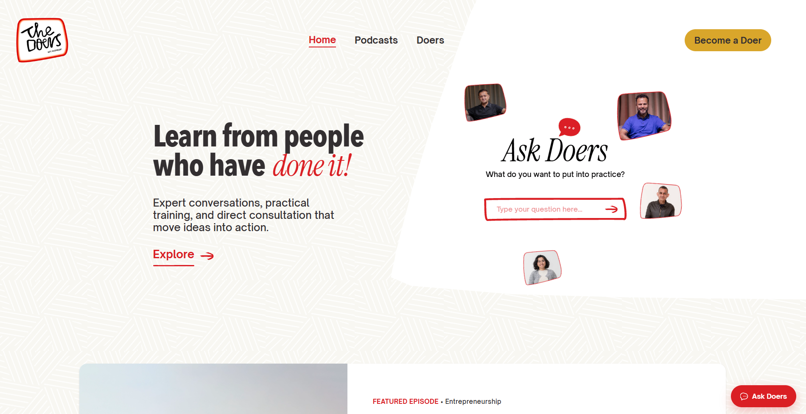
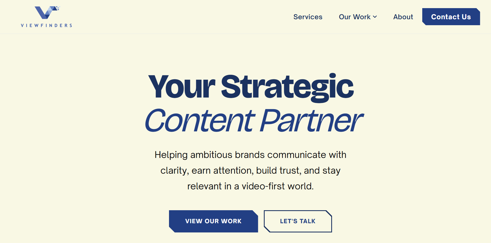

Full stack products, the automation sitting between your tools, and the dashboards that turn your data into a decision, all built by one person instead of three freelancers who each own a different piece.

&nbsp;&nbsp;&nbsp;&nbsp;&nbsp;&nbsp;

 

## About

Full stack developer, automation builder, and data analyst, in one person. AI made the how of writing software easy, so I spend my time on the part that didn't get easier: deciding what's actually worth building.

<table>
<tr>
<td width="33%" valign="top">

**Development**
Next.js and React up front, Django or FastAPI behind it, shipped as real APIs and MVPs.

</td>
<td width="33%" valign="top">

**Automation**
The repetitive work between your tools, automated: workflows connected, AI features embedded, scripts running quietly in the background.

</td>
<td width="33%" valign="top">

**Data & Analysis**
Scattered numbers turned into dashboards that keep answering the same question on their own.

</td>
</tr>
</table>

 

## Tech Stack

**Frontend**

**Backend & APIs**

**AI, Agents & Automation**

&nbsp;&nbsp;&nbsp;&nbsp;&nbsp;&nbsp;

**Data, BI & Infra**

&nbsp;&nbsp;

Framework agnostic by design. The stack above is what I reach for most, not the limit of what I work in.

 

## Featured Projects

<table>
<tr>
<td width="50%" valign="top">

### [Doers Nepal](https://doersnepal.com)

The Doers is a podcast and expert consultation platform connecting people in Nepal with accomplished practitioners, through conversations, training, and direct consulting. This is the project I'm most proud of, with the entire backend built by me, including the pipeline that automates about 80 percent of its articles and insights.

**My role:** backend architecture and the content automation pipeline, all built by me.

&nbsp;&nbsp;

</td>
<td width="50%" valign="top">

### [ViewFinders Studio](https://viewfinders.studio)

Viewfinders is a strategic content and media production studio based in Kathmandu, working across video production, brand storytelling, and digital strategy for clients in fintech, FMCG, healthcare, and education. I built this one solo end to end.

**My role:** backend, frontend, and visual design, all built by me.

</td>
</tr>
</table>

 

## Data & Analytics Projects

<table>
<tr>
<td width="50%" valign="top">

**[Spotify Analytics Dashboard](https://github.com/ishnom/spotify-analytics-dashboards)**

A Power BI project analyzing personal Spotify listening history across three linked views: an overview of albums, artists, and tracks, a listening pattern dashboard surfacing time based behavioral trends, and a drill through dashboard that goes from album level down to individual tracks, with dynamic filtering by platform, shuffle, and repeat mode.

 Power BI &nbsp;+&nbsp; DAX

</td>
<td width="50%" valign="top">

**[Loan Insights Analytics Dashboard](https://github.com/ishnom/Loan-Insights-Analytics-Dashboard)**

An interactive Power BI dashboard built for loan portfolio monitoring: repayment behavior, risk distribution, geographic trends, and KPIs like funded amounts and interest rates, giving stakeholders a real time view for portfolio and risk decisions instead of a static monthly report.

 Power BI &nbsp;+&nbsp; DAX

</td>
</tr>
</table>

 

## AI & Automation Work

Alongside the public projects above, I build AI agents and automation systems for clients as internal tooling, which means the repositories themselves stay private. The pattern across that work: LLM agents (OpenAI and Claude) wired into a client's existing systems through tool calling, MCP, and agent harnesses like OpenClaw, automating things like Notion and knowledge base workflows, internal reporting, and content operations that used to be manual. I'm showcasing the category here rather than the client work directly, out of respect for what's private.

 

## Let's Build Something

Got a problem worth solving, not just a feature to ship? That's exactly where I work: the product, the automation behind it, and the dashboard that proves it worked.

[**Email me**](mailto:ishworsubedinetwork@gmail.com) &nbsp;•&nbsp; [**LinkedIn**](https://www.linkedin.com/in/ishwor-subedi-55613632a/)

